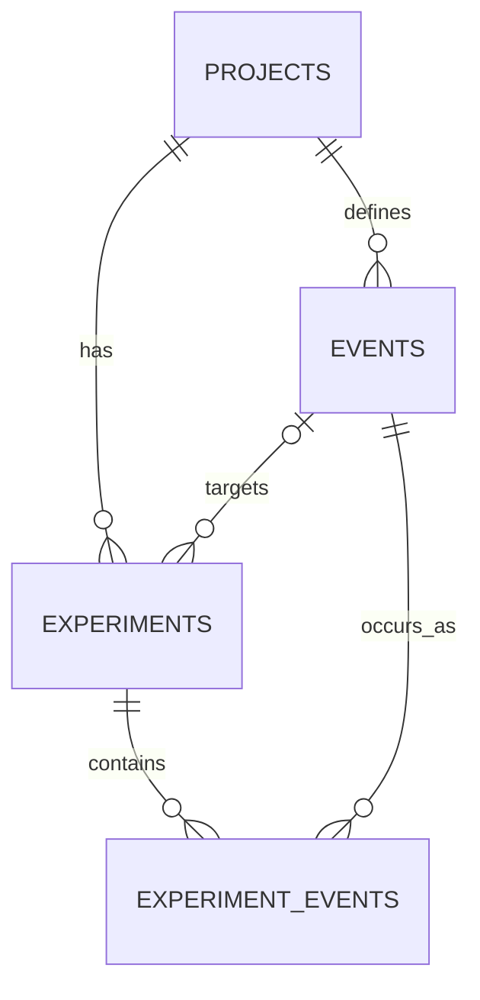

# EventProof — Review 1

## Problem Statement

Event-driven workflows may behave incorrectly when an event is delivered twice or not delivered at all. EventProof lets a user define an ordered event flow, inject a duplicate or drop, and inspect the resulting execution timeline.

## Review 1 Scope

This part uses Java 25, JavaFX with FXML and CSS, Maven, PostgreSQL, and plain JDBC. The desktop app creates projects and event definitions, runs NORMAL, DUPLICATE, and DROP experiments, saves their timelines, and reopens saved results. Spring Boot, Kafka, Redis, React, and deployment infrastructure are future work.

## Architecture

```text
JavaFX → Controller → Service → DAO → JDBC → PostgreSQL
                    ↘ ExperimentEngine (pure Java)
```

Controllers coordinate UI state and call services. DAOs contain SQL. `ExperimentEngine` receives event definitions in memory and generates a timeline without JavaFX or database access.

## Database Design

| Table | Purpose |
| --- | --- |
| `projects` | Names a system or workflow under test. |
| `events` | Defines a project's original events, ordered by `sequence_no`; `sample_payload` is optional JSONB. |
| `experiments` | Records a run, its fault type, optional target event, status, and creation time. |
| `experiment_events` | Records each generated occurrence in `execution_order`, with NORMAL or DUPLICATE occurrence kind. A dropped event has no occurrence row. |



## Important Database Concepts

Identity primary keys identify rows. Foreign keys link child rows to their project, experiment, or source event, with restricted deletion. `UNIQUE(project_id, sequence_no)` prevents two definitions occupying one position; `UNIQUE(experiment_id, execution_order)` prevents two occurrences occupying one timeline position. CHECK constraints require positive positions, nonblank names, valid fault/status/kind values, and a target event for DUPLICATE or DROP. Service logic ensures referenced events belong to the experiment's project.

## JDBC Concepts Used

`DriverManager` opens a `Connection` from local configuration. DAOs use `PreparedStatement` parameters, read `ResultSet` values, and close resources with try-with-resources. Saving an experiment uses one transaction: insert it as PENDING, insert its occurrences, mark it COMPLETED, then commit. Any write failure triggers rollback, so a partial timeline is not saved.

## Experiment Logic

The engine processes definitions by `sequence_no` and numbers generated occurrences from 1:

| Fault | Original | Generated |
| --- | --- | --- |
| NORMAL | A B C | A B C |
| DUPLICATE B | A B C | A B B C |
| DROP B | A B C | A C |

For DUPLICATE, the extra B appears immediately after the original and has occurrence kind DUPLICATE. For DROP, B is omitted and execution orders close the gap.

## Demo Flow

Select **Payment Processing Demo** in Projects and confirm this original order:

1. `ORDER_CREATED`
2. `PAYMENT_COMPLETED`
3. `INVENTORY_RESERVED`
4. `ORDER_CONFIRMED`

In Experiments, enter **Duplicate Payment Demo**, select that project, choose **DUPLICATE**, target **PAYMENT_COMPLETED**, and run it. The saved timeline should be:

| Execution | Event | Occurrence |
| ---: | --- | --- |
| 1 | `ORDER_CREATED` | NORMAL |
| 2 | `PAYMENT_COMPLETED` | NORMAL |
| 3 | `PAYMENT_COMPLETED` | DUPLICATE |
| 4 | `INVENTORY_RESERVED` | NORMAL |
| 5 | `ORDER_CONFIRMED` | NORMAL |

Select the run in Experiment History to reopen its persisted result. The bundled sample SQL also includes one completed duplicate experiment.

## Testing

`mvn clean test` runs 28 automated tests: 21 pure engine unit tests, a JDBC connection test, Project/Event/Experiment DAO integration tests (including rollback), and a complete service-flow integration test. Integration tests require a local PostgreSQL database with `schema.sql` applied and an ignored `src/main/resources/database.properties` based on `database.properties.example`. Start the desktop app with `mvn javafx:run`.

## Future Work

Possible later parts include a Spring Boot API, Kafka integration, more reliability faults, tests against real consumers, and a React frontend. They are outside Review 1.
